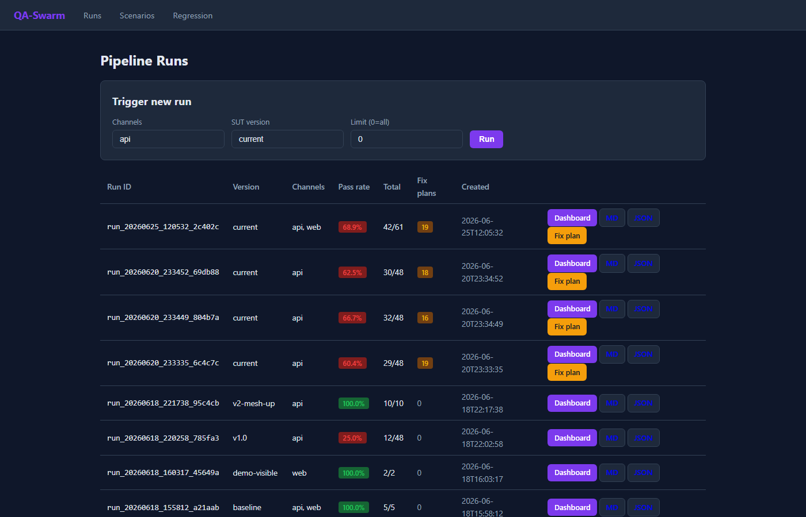
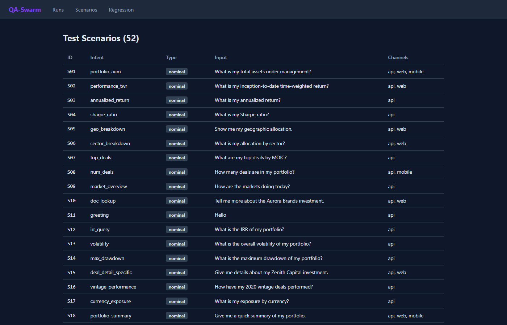
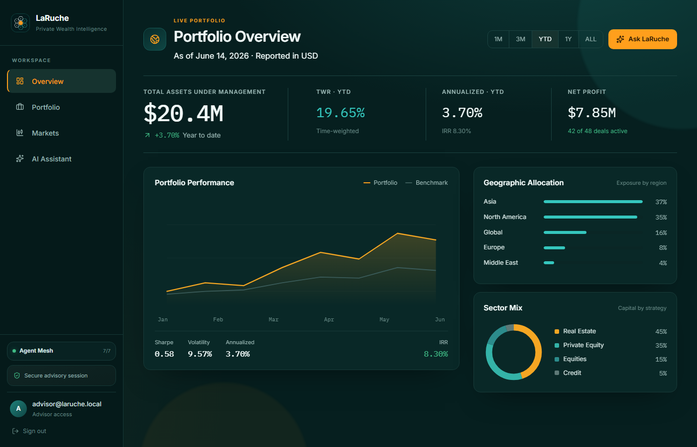
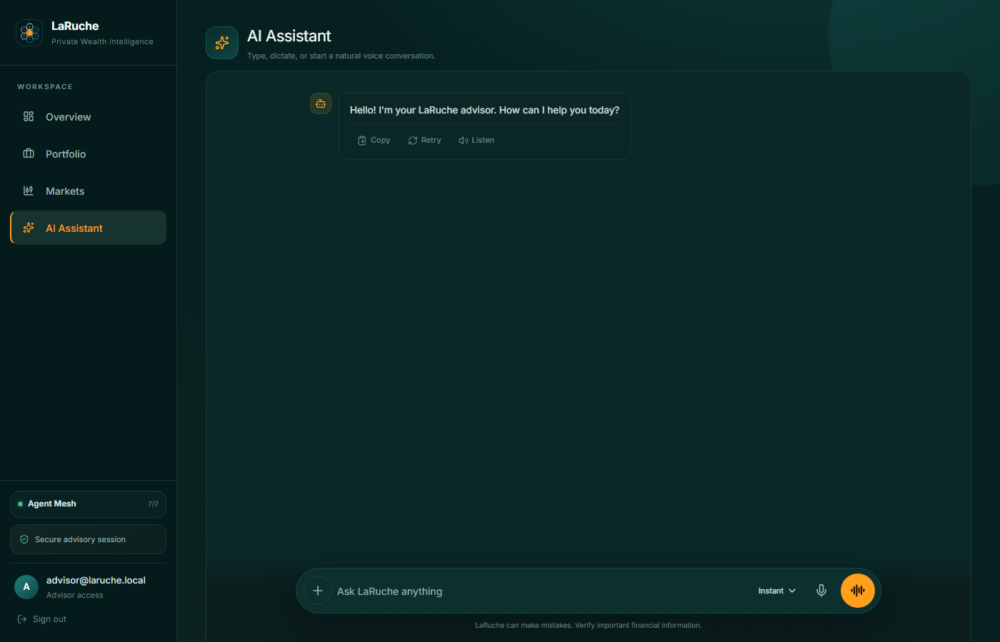

# Autonomous Agent Testing — QA-Swarm

> An autonomous, multi-agent testing system that puts a conversational AI agent under test
> across **API, Web, and Mobile**, scores every answer for quality and hallucination, and
> **detects regressions between two versions** of the target agent — entirely on local
> Small Language Models via **Ollama**, with **no data leaving the machine**.

Engineering internship project (ESPRIT, 2025–2026) carried out at **Value**.
The graded deliverable is the testing system in [`qa-swarm/`](qa-swarm/); the
wealth-management assistant in [`services/`](services/) and [`frontend/`](frontend/) is the
**System Under Test (SUT)** it exercises.

---

## Why this exists

Conversational agents are hard to test: answers are free-form, non-deterministic, and a
"small" prompt change can silently degrade quality or reintroduce hallucinations. Manual QA
doesn't scale and traditional assertion-based tests don't capture *answer quality*.

**QA-Swarm** automates the full testing lifecycle with a chain of cooperating agents:

```
 ┌───────────┐   ┌───────────┐   ┌───────────┐   ┌───────────┐   ┌─────────────┐
 │ Generator │──▶│ Executor  │──▶│ Evaluator │──▶│ Reporter  │──▶│ FixPlanner  │
 └───────────┘   └─────┬─────┘   └───────────┘   └───────────┘   └─────────────┘
   loads/synth.        │            scores            reports         safe, non-
   the corpus    API / Web / Mobile  1–5 + halluc.   MD + Plotly      destructive plan
```

Each stage hands off to the next; the run is persisted as structured JSON plus human-readable
reports. The whole pipeline runs against **local SLMs** (`qwen2.5:3b` through Ollama), so it is
free to run, private by construction, and reproducible offline.

---

## Key features

- **Multi-channel execution** — the same scenario is driven through three real surfaces:
  - **API** — `httpx` → `POST /api/chat`, SSE parsing, latency / time-to-first-token / status.
  - **Web** — an SLM generates a **Playwright** script that drives the live React chat UI; runs sandboxed in a subprocess with an `ast.parse` guard and a hard timeout.
  - **Mobile** — an SLM generates an **Appium** (UiAutomator2) script against the Expo app on an Android emulator.
- **Quality scoring** — every answer is judged (1–5) on **pertinence, exactitude, coherence**, plus an explicit **hallucination** check (LLM-as-judge, strict JSON).
- **Blocking failure rules** — timeout, crash / 5xx, empty reply, or detected hallucination fail the scenario regardless of score.
- **Regression detection (the success criterion)** — compare two runs (two SUT versions) and flag **PASS→FAIL flips, score drops, and latency spikes**.
- **Interactive reports** — Markdown + an embedded **Plotly** dashboard (pass rate, latency by channel, score distribution, failure breakdown).
- **Safe FixPlanner** — for each failure it produces a triage + manual repair plan (category, severity, likely owner, affected files, steps, verification commands). It **never** edits, patches, commits, or pushes — `auto_apply=false`, `human_approval_required=true`.
- **Backoffice console** — a FastAPI UI to trigger runs, browse the scenario corpus, open dashboards, and diff two runs from the browser.
- **52-scenario versioned corpus** — nominal financial questions, limit/edge cases, and adversarial prompts (empty input, prompt injection, out-of-domain), tagged per channel.

---

## Screenshots

| Backoffice — pipeline runs | Scenario corpus |
|---|---|
|  |  |

| System Under Test — dashboard | System Under Test — chat |
|---|---|
|  |  |

---

## Architecture

| Component | Role | Model |
|---|---|---|
| **Generator** | Loads / synthesizes test cases from the JSON corpus | `qwen2.5:3b` |
| **Executor** | Dispatches each case to API, Web, or Mobile | `qwen2.5:3b` |
| **Evaluator** | Scores pertinence, exactitude, coherence, hallucination | `qwen2.5:3b` |
| **Reporter** | Produces Markdown + Plotly HTML reports | `qwen2.5:3b` |
| **FixPlanner** | Classifies failures, writes safe manual fix plans | heuristics + agent card |

**Stack:** Python 3.12 · [OpenAI Swarm](https://github.com/openai/swarm) handoffs ·
[Ollama](https://ollama.com) (local SLMs) · `httpx` · Playwright · Appium · Plotly ·
FastAPI · pydantic · `uv` workspace · pytest.

---

## Quick start

### Prerequisites

- Python 3.12+ and [`uv`](https://docs.astral.sh/uv/)
- [Ollama](https://ollama.com) running locally
- The SUT running locally (see [Running the System Under Test](#running-the-system-under-test))

```bash
ollama pull qwen2.5:3b

cd qa-swarm
uv sync
uv pip install -e ".[report]"      # Plotly dashboard
uv pip install -e ".[backoffice]"  # FastAPI console
uv pip install -e ".[web]"         # optional: Playwright web channel
uv pip install -e ".[mobile]"      # optional: Appium mobile channel
```

### Run the pipeline

```bash
# API channel, full corpus
uv run python -m swarm_qa.pipeline --channel api

# Multiple channels, a subset, tagged with a version label
uv run python -m swarm_qa.pipeline --channel api web --limit 5 --version baseline
```

Each run writes to `qa-swarm/swarm_qa/runs/<run_id>/`:

| File | Contents |
|---|---|
| `run.json` | Full structured run output |
| `report.md` | Markdown report (results table + pass rate) |
| `report.html` | Interactive Plotly dashboard (with the `report` extra) |
| `fix_plan.json` | Machine-readable triage + manual fix plans for failures |

### Backoffice console

```bash
uv run uvicorn backoffice.app:app --port 8090 --reload
# open http://localhost:8090
```

Trigger runs, browse the 52 scenarios, view dashboards, and compare two runs side by side.

### Regression detection

```python
from pathlib import Path
from swarm_qa.regression import compare_from_files

reg = compare_from_files(
    Path("swarm_qa/runs/run_baseline/run.json"),
    Path("swarm_qa/runs/run_candidate/run.json"),
)
print(reg.has_regressions)   # True if any PASS→FAIL flip, score drop, or latency spike
```

### Tests

```bash
cd qa-swarm
uv run pytest tests -q     # pipeline unit tests (mocked SUT, no Ollama needed)
uv run python ci_smoke.py  # CI smoke gate
```

---

## Running the System Under Test

The SUT is a private-banking conversational assistant built as a small fleet of specialist
agents (financial, market, documents, action, voice) behind a LangGraph orchestrator. It
exposes exactly the three surfaces QA-Swarm targets: `POST /api/chat` (API), a React web app
(Web), and an Expo app (Mobile).

```bash
# 1. Local models
ollama pull qwen2.5:3b
ollama pull nomic-embed-text

# 2. Infrastructure (Postgres, Redis, Qdrant, Keycloak, MailHog, …)
docker compose -f docker-compose.dev.yml up -d

# 3. Python deps for the whole workspace
uv sync

# 4. Web app (dev auth bypass on by default)
cd frontend && npm install && npm run dev
```

By default `KEYCLOAK_URL` is unset, so the backend accepts a dev bearer token and the web app
auto-authenticates — the pipeline can hit the API immediately. See
[`qa-swarm/README.md`](qa-swarm/README.md) and [`qa-swarm/TESTING_GUIDE.md`](qa-swarm/TESTING_GUIDE.md)
for the full channel setup (Playwright / Appium), and the SUT details below.

<details>
<summary><strong>SUT details — services, ports, and compliance</strong></summary>

| Service | Port | Description |
|---|---|---|
| orchestrator | 8000 | LangGraph supervisor + auth/verify + GDPR endpoints |
| agent-financial | 8001 | AUM, TWR, IRR, Sharpe, geo/sector breakdowns |
| agent-market | 8002 | Market quotes, economic indicators |
| agent-docs | 8003 | Chunking, Ollama embeddings, Qdrant semantic search |
| agent-action | 8004 | Report generation, email (MailHog), messaging stub |
| agent-qa | 8005 | LLM-generated pytest + sandboxed runner |
| voice | 8006 | STT (faster-whisper) + TTS (Piper) + voice-to-voice |

- **Auth:** Keycloak (RS256 JWT, PKCE for web/mobile) with a dev-bypass mode for local runs.
- **GDPR:** `DELETE /api/gdpr/delete-my-data` (Right to Erasure), audit log, voice audio never persisted.
- **EU AI Act:** Limited-Risk classification, local-only inference, model register in [`docs/ai-act-model-register.json`](docs/ai-act-model-register.json).
- **Guardrails:** prompt-injection and PII-exfiltration patterns checked before any agent call.

All data is synthetic. All inference runs locally on a single GPU (built/benchmarked on an
RTX 2050, 4 GB VRAM — one model loaded at a time).

</details>

---

## Repository layout

```text
.
├── qa-swarm/              ← the autonomous testing system (primary deliverable)
│   ├── swarm_qa/
│   │   ├── agents/        # generator, executor, evaluator, reporter, fix_planner
│   │   ├── channels/      # api / web (Playwright) / mobile (Appium)
│   │   ├── scoring/       # quality metrics + hallucination judge
│   │   ├── corpus/        # 52 versioned scenarios
│   │   ├── pipeline.py    # Generator→Executor→Evaluator→Reporter handoff run
│   │   └── regression.py  # two-version regression detection
│   ├── backoffice/        # FastAPI console (trigger runs, dashboards, diffs)
│   └── tests/             # pytest for the pipeline itself
│
├── services/             ← System Under Test: the agentic mesh (orchestrator + agents)
├── frontend/             ← SUT web app (React + Vite + Tailwind)
├── mobile/               ← SUT mobile app (React Native / Expo)
├── libs/                 ← shared libraries (agentkit, db)
├── infra/                ← Traefik, Keycloak realm, Postgres init
├── helm/ · evals/ · docs/
└── rapport-stage/        ← internship report (LaTeX) + screenshots
```

---

## Author

**Amine Manai** — Engineering student (4DS), ESPRIT — internship at **Value**, 2025–2026.

Supervised by **Ahmed Rebai**.
