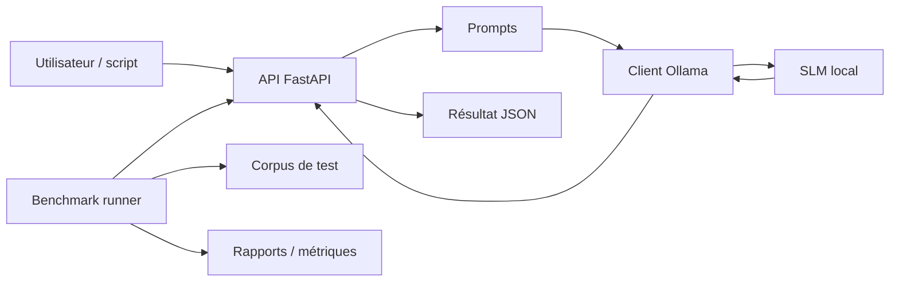
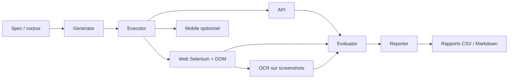

# Architecture détaillée des deux projets

Ce document décrit les deux architectures séparément, avec ce qu'elles contiennent, à quoi elles servent et ce que tu vas faire dedans.

## Vue d'ensemble

Les deux projets sont liés, mais ils ont des rôles différents :

- **Projet 1** : construire et exposer un moteur IA local avec `Ollama` et `FastAPI`.
- **Projet 2** : tester ce moteur ou un autre agent conversationnel de façon automatique avec `Selenium`, le `DOM`, l'`OCR` et éventuellement `Appium`.

Le premier projet produit le service. Le second mesure, vérifie et met en évidence les défauts.

## Projet 1 — SLMs locaux + FastAPI + benchmark

### Objectif

Le Projet 1 sert à :

- lancer des SLMs en local avec `Ollama`
- exposer une API propre via `FastAPI`
- centraliser les prompts et les tâches NLP
- benchmarker plusieurs modèles sur un même corpus
- générer des métriques et des rapports

### Ce que contient le projet

Dans `project1_slm_fastapi`, tu vas organiser le code en plusieurs blocs :

- `src/slm_api/` : tout ce qui concerne l'API et l'appel à Ollama
- `src/benchmark/` : tout ce qui concerne le benchmark des modèles
- `data/corpus/` : les exemples de textes ou questions à tester
- `reports/benchmark/` : les résultats, tableaux et graphiques
- `k8s/` : les manifests si tu veux exécuter l'API dans `Minikube`

### Ce que tu vas faire dedans

Tu vas construire :

1. un client `Ollama` qui envoie un prompt à un modèle local
2. une API `FastAPI` avec des endpoints comme `/nlp/process`
3. des schémas d'entrée et de sortie pour normaliser les réponses
4. des prompts par tâche : résumé, extraction, Q&A, classification
5. un runner de benchmark pour comparer les modèles
6. des exports de résultats pour l'analyse

### Architecture fonctionnelle



### Arborescence logique

```text
project1_slm_fastapi/
├── src/
│   ├── slm_api/
│   │   ├── main.py
│   │   ├── schemas.py
│   │   ├── prompts.py
│   │   └── ollama_client.py
│   └── benchmark/
│       ├── runner.py
│       └── metrics.py
├── data/
│   └── corpus/
├── reports/
│   └── benchmark/
├── tests/
├── k8s/
└── Dockerfile
```

### À quoi servent les fichiers clés

- `main.py` : démarre l'API et route les requêtes
- `schemas.py` : définit les données attendues et retournées
- `prompts.py` : fabrique les prompts selon la tâche
- `ollama_client.py` : interagit avec Ollama en local
- `runner.py` : exécute le benchmark sur plusieurs cas
- `metrics.py` : calcule les indicateurs utiles

### Déploiement

Tu peux l'exécuter de trois façons :

- en local avec Python + `uvicorn`
- en conteneur avec `Docker Desktop`
- dans `Minikube` si tu veux simuler un déploiement Kubernetes

---

## Projet 2 — Testing agentique avec Selenium, DOM, OCR

### Objectif

Le Projet 2 sert à tester automatiquement un agent ou une API conversationnelle. Il ne construit pas le modèle, il le vérifie.

### Ce que contient le projet

Dans `project2_agentic_testing`, tu vas organiser le code en plusieurs blocs :

- `src/testing_agentic/generator.py` : génération des cas de test
- `src/testing_agentic/executors/` : exécution par canal
- `src/testing_agentic/evaluator.py` : scoring et verdicts
- `src/testing_agentic/reporter.py` : création de rapports
- `src/testing_agentic/ocr.py` : lecture des screenshots
- `data/test_cases/` : cas de test en JSON
- `reports/` : résultats et exports

### Ce que tu vas faire dedans

Tu vas construire :

1. un générateur de cas de test
2. un exécuteur API qui appelle le Projet 1
3. un exécuteur Web basé sur `Selenium`
4. une logique basée sur le `DOM` pour cliquer, taper et vérifier les éléments
5. un module `OCR` pour lire les screenshots
6. un évaluateur pour comparer `expected` et `actual`
7. un reporter qui écrit les résultats dans des fichiers lisibles

### Architecture fonctionnelle



### Arborescence logique

```text
project2_agentic_testing/
├── src/
│   └── testing_agentic/
│       ├── orchestrator.py
│       ├── generator.py
│       ├── evaluator.py
│       ├── reporter.py
│       ├── ocr.py
│       └── executors/
│           ├── api_executor.py
│           ├── web_executor.py
│           └── mobile_executor.py
├── data/
│   └── test_cases/
├── reports/
├── tests/
└── Dockerfile
```

### À quoi servent les fichiers clés

- `generator.py` : fabrique les scénarios de test
- `api_executor.py` : teste directement l'API du Projet 1
- `web_executor.py` : automatise le navigateur avec `Selenium`
- `ocr.py` : lit le texte visible sur les captures écran
- `evaluator.py` : décide si le test est passé ou non
- `reporter.py` : exporte un résumé exploitable

### Rôle de Selenium, DOM et OCR

- `Selenium` sert à simuler un utilisateur web.
- Le `DOM` sert à sélectionner les boutons, champs et messages.
- L'`OCR` sert à vérifier visuellement ce qui est réellement affiché.

### Déploiement

Tu peux exécuter ce projet :

- en local avec Python
- dans un conteneur avec `Docker Desktop`
- dans `Minikube` si tu veux isoler les tests ou reproduire un environnement plus proche de la production

---

## Relation entre les deux architectures

Le Projet 1 produit l'API et les réponses du modèle. Le Projet 2 consomme cette API, simule des utilisateurs, compare les résultats et détecte les régressions.

En pratique :

- le Projet 1 = logique métier IA
- le Projet 2 = validation qualité et automatisation des tests
